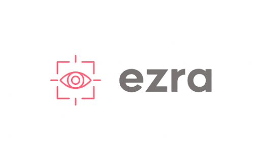

# Ezra

Ezra, meaning Helper, is a company that aims to enhance the role of technology in the retail industry using Computer Vision.

Table of Contents
---

- [People](./team/)
- [Team Principles](./team/principles.md)
- [Diversity](./team/diversity.md)
- [Product & Research](./product_research/)
    - [Market](./product_research/market.md)
    - [Roadmap](./product_research/roadmap.md)
- [Use Cases](./use_cases.md)
- [High Level Architecture](./architecture.md)
- [UX Research](./ux_research/)
    - [Summary](./ux_research/summary.md)
    - [Raw Notes](./ux_research/raw_notes.md)
