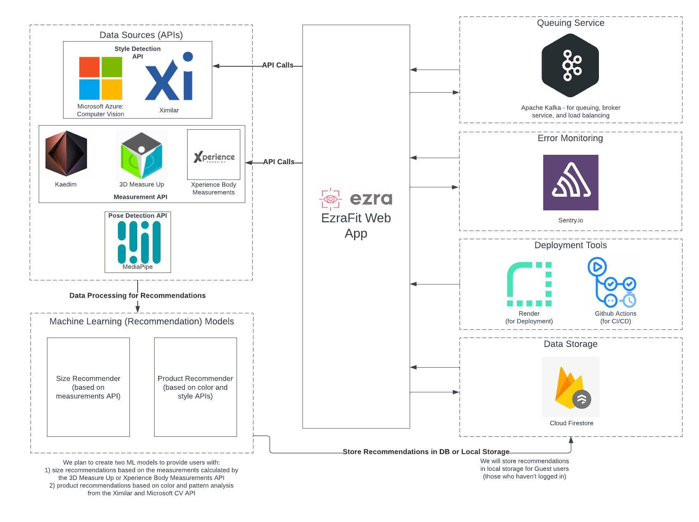

# High Level Architecture

The architecture diagram above outlines the core components of EzraFit, our startup's product, that utilizes Computer Vision (CV) to optimise a user's shopping experience. Using various CV APIs, EzraFit will determine a user's measurements and analyse their preferred style to provide size and product recommendations across various clothing items. Recommendations will be generated using Machine Learning models, which will then be stored in the Firestore database or in local storage.

To prevent a server overload and crash, Apache Kafka will be used for queuing, broker, and load balancing services. 

Additional tools will be used to facilitate smooth development and and deployment (Render and Github Actions) and error monitoring  (Sentry) and interception once the code is released to production. 