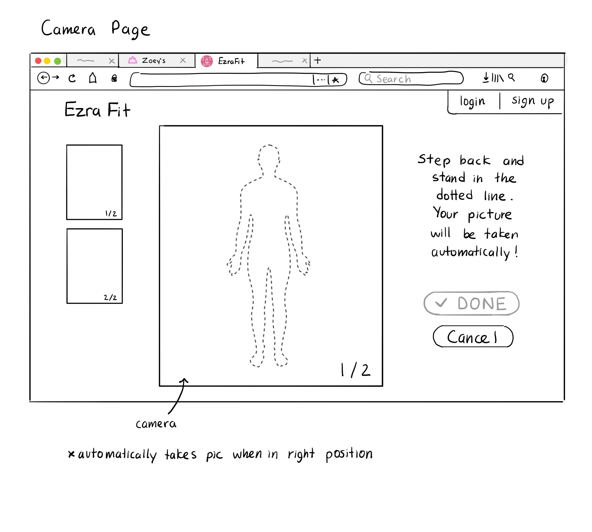
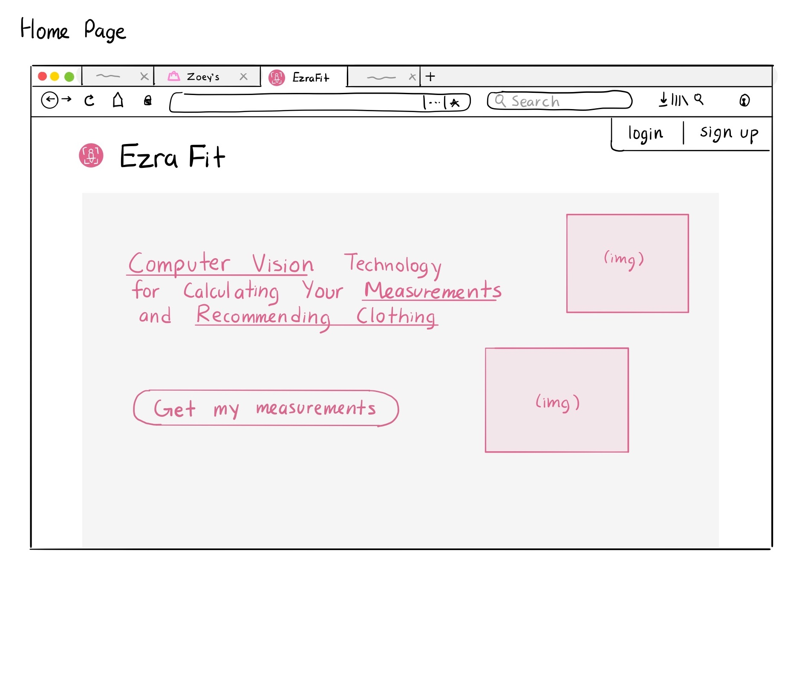

# Use Cases

**1. Take images and extract body measurements using CV**

- The user takes photos of their body from 2 different angles (wearing tight-fitting clothing)
They will be given a guide on how they need to stand and feedback on whether they’re following it correctly
- Then a Computer Vision (CV) algorithm will analyze these images to extract the person’s body measurements

The user clicks "EzraFit," which opens an info popup. Clicking "Get My Size!" will take them to the EzraFit app, where they can take photos to get their measurements:

The user can also navigate to the camera page directly from the EzraFit home page, by clicking "Get my measurements":

**2. Get user’s size for a particular clothing store**

- This will be based on the user’s calculated measurements and the company’s sizing guide, and possibly more information (e.g. whether the user prefers to size-up to get a looser fit)
- The EzraFit recommended size will be displayed near the size selection for a clothing item

**3. User enters their style preferences or uploads images that show their style**

- This will be done in the EzraFit website
- The images could be taken on the spot (similar to the body calculations), but ideally, the user could upload any photos of clothing or people wearing clothes

**4. Recommendations given of similar items using uploaded images of style or form**

- In the clothing website that has EzraFit, there will be an option to filter items based on what EzraFit recommends

**5. Create a user account (optional)**

- This stores preferences, measurements, and purchase patterns
- If an account is not created, all data will instead be stored in cookies
